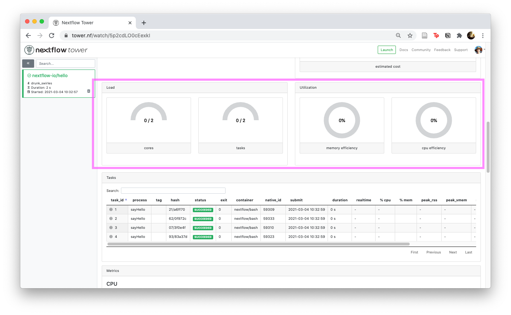

# 2017 Nextflow

```
nextflow run next_baton.nf

N E X T F L O W  ~  version 22.10.0
Launching `next_baton.nf` [happy_roentgen] DSL2 - revision: 4e1f6f8ca7

Pipeline = Alice -> Bob -> Cathy -> Dave -> Eve
 where each person runs 5 seconds to pass the baton to next person

executor >  local (5)
[a0/6d6277] process > Alice [100%] 1 of 1 ✔
[ed/a34e08] process > Bob   [100%] 1 of 1 ✔
[c1/dbc37a] process > Cathy [100%] 1 of 1 ✔
[1b/415d18] process > Dave  [100%] 1 of 1 ✔
[8d/d951c3] process > Eve   [100%] 1 of 1 ✔
/Users/jchang3/github/j23414/compare_workflows/2017_Nextflow/work/8d/d951c35cc8ebede31c2f5ae4c7aec5/Eve_baton.txt
```

## View work directory

```
tree -a work 

work
├── 1b
│   └── 415d18adab625f579c622db59e6184
│       ├── .command.begin
│       ├── .command.err
│       ├── .command.log
│       ├── .command.out
│       ├── .command.run
│       ├── .command.sh
│       ├── .exitcode
│       ├── Cathy_baton.txt -> /Users/jchang3/github/j23414/compare_workflows/2017_Nextflow/work/c1/dbc37a7011a9b2c3120b1f788e1375/Cathy_baton.txt
│       └── Dave_baton.txt
├── 8d
│   └── d951c35cc8ebede31c2f5ae4c7aec5
│       ├── .command.begin
│       ├── .command.err
│       ├── .command.log
│       ├── .command.out
│       ├── .command.run
│       ├── .command.sh
│       ├── .exitcode
│       ├── Dave_baton.txt -> /Users/jchang3/github/j23414/compare_workflows/2017_Nextflow/work/1b/415d18adab625f579c622db59e6184/Dave_baton.txt
│       └── Eve_baton.txt
├── a0
│   └── 6d627760375285d1fb919c2213567c
│       ├── .command.begin
│       ├── .command.err
│       ├── .command.log
│       ├── .command.out
│       ├── .command.run
│       ├── .command.sh
│       ├── .exitcode
│       └── Alice_baton.txt
├── c1
│   └── dbc37a7011a9b2c3120b1f788e1375
│       ├── .command.begin
│       ├── .command.err
│       ├── .command.log
│       ├── .command.out
│       ├── .command.run
│       ├── .command.sh
│       ├── .exitcode
│       ├── Bob_baton.txt -> /Users/jchang3/github/j23414/compare_workflows/2017_Nextflow/work/ed/a34e08e4ecf606e7730ba5518dd62c/Bob_baton.txt
│       └── Cathy_baton.txt
└── ed
    └── a34e08e4ecf606e7730ba5518dd62c
        ├── .command.begin
        ├── .command.err
        ├── .command.log
        ├── .command.out
        ├── .command.run
        ├── .command.sh
        ├── .exitcode
        ├── Alice_baton.txt -> /Users/jchang3/github/j23414/compare_workflows/2017_Nextflow/work/a0/6d627760375285d1fb919c2213567c/Alice_baton.txt
        └── Bob_baton.txt

11 directories, 44 files
```

PublishDir

```
Tree results 

results
├── Alice_baton.txt -> /Users/jchang3/github/j23414/compare_workflows/2017_Nextflow/work/a0/6d627760375285d1fb919c2213567c/Alice_baton.txt
├── Bob_baton.txt -> /Users/jchang3/github/j23414/compare_workflows/2017_Nextflow/work/ed/a34e08e4ecf606e7730ba5518dd62c/Bob_baton.txt
├── Cathy_baton.txt -> /Users/jchang3/github/j23414/compare_workflows/2017_Nextflow/work/c1/dbc37a7011a9b2c3120b1f788e1375/Cathy_baton.txt
├── Dave_baton.txt -> /Users/jchang3/github/j23414/compare_workflows/2017_Nextflow/work/1b/415d18adab625f579c622db59e6184/Dave_baton.txt
└── Eve_baton.txt -> /Users/jchang3/github/j23414/compare_workflows/2017_Nextflow/work/8d/d951c35cc8ebede31c2f5ae4c7aec5/Eve_baton.txt
```

# Nextflow Tower

1. Create a free account (or link your github) at http://tower.nf
2. Create a token
3. Add token to your `.bashrc` or `.profile`
4. Run a pipeline using the `-with-tower` flag

```
nextflow run hello -with-tower
CAPSULE: Downloading dependency io.nextflow:nf-httpfs:jar:20.10.0
CAPSULE: Downloading dependency io.nextflow:nf-commons:jar:20.10.0
CAPSULE: Downloading dependency org.codehaus.groovy:groovy-nio:jar:3.0.5
CAPSULE: Downloading dependency org.codehaus.groovy:groovy-json:jar:3.0.5
CAPSULE: Downloading dependency io.nextflow:nextflow:jar:20.10.0
CAPSULE: Downloading dependency org.codehaus.groovy:groovy:jar:3.0.5
CAPSULE: Downloading dependency io.nextflow:nf-tower:jar:20.10.0
CAPSULE: Downloading dependency org.codehaus.groovy:groovy-templates:jar:3.0.5
CAPSULE: Downloading dependency org.codehaus.groovy:groovy-xml:jar:3.0.5
CAPSULE: Downloading dependency io.nextflow:nf-amazon:jar:20.10.0
N E X T F L O W  ~  version 20.10.0                              
Launching `nextflow-io/hello` [drunk_swirles] - revision: 96eb04d6a4 [master]
NOTE: Your local project version looks outdated - a different revision is available in the remote repository [e6d9427e5b]
Monitor the execution with Nextflow Tower using this url https://tower.nf/watch/5p2cdLO0cEexkI
executor >  local (4)
[62/0f972c] process > sayHello (1) [100%] 4 of 4 ✔
Hola world!

Ciao world!

Hello world!

Bonjour world!

WARN: Task runtime metrics are not reported when using macOS without a container engine
```

Looks neat so far



Definitely interested in the core/task/memory efficiency dashboard.

[ ] Test this on HPC Slurm system
