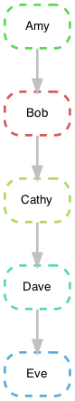

# Workflow languages

Recently, there has been an ascension of workflow languages to create reproducible, cloud computing agnostic, parallizable, and provenence tracked pipelines. 

* Köster, J. and Rahmann, S., 2012. [Snakemake—a scalable bioinformatics workflow engine](https://academic.oup.com/bioinformatics/article/28/19/2520/290322?login=true). Bioinformatics, 28(19), pp.2520-2522.
* Amstutz, P., Tijanić, N., Soiland-Reyes, S., Kern, J., Stojanovic, L., Pierce, T., Chilton, J., Mikheev, M., Lampa, S., Ménager, H. and Frazer, S., 2015, July. [Portable workflow and tool descriptions with the CWL](https://www.research.manchester.ac.uk/portal/en/publications/portable-workflow-and-tool-descriptions-with-the-cwl(f71e169b-8724-4580-86d6-e621077d8c74).html). In Bioinformatics Open Source Conference.
* Amstutz, P., Crusoe, M.R., Tijanić, N., Chapman, B., Chilton, J., Heuer, M., Kartashov, A., Leehr, D., Ménager, H., Nedeljkovich, M. and Scales, M., 2016. [Common workflow language, v1.0.](https://www.research.manchester.ac.uk/portal/en/publications/common-workflow-language-v10(741919f5-d0ab-4557-9763-b811e911423b)/export.html#export)
* Di Tommaso, P., Chatzou, M., Floden, E.W., Barja, P.P., Palumbo, E. and Notredame, C., 2017. [Nextflow enables reproducible computational workflows](https://www.nature.com/articles/nbt.3820). Nature biotechnology, 35(4), pp.316-319.

Here we aim to explore, compare, and contrast several workflow languages for our internal workflow development. There are several academic papers that explore these workflow languages in certain domains, especially relating to bioinformatic analysis.

## 2012 -  Explore Snakemake

Snakemake is a python program and can be installed via miniconda using the provided `environment.yml` file.

```
conda env create -f environment.yml
conda activate snakeskin
```

Create `snake_say_hi.txt`

```
rule all:
  input: "hello_world.txt"

rule hello_world:
  output: "hello_world.txt"
  shell: "echo Hello World > hello_world.txt"
```

It looks basically like a Makefile. Run it via:

```
snakemake --snakefile snake_say_hi.txt -j1
```

which gives:

```
Building DAG of jobs...
Using shell: /bin/bash
Provided cores: 1 (use --cores to define parallelism)
Rules claiming more threads will be scaled down.
Job counts:
	count	jobs
	1	all
	1	hello_world
	2
Select jobs to execute...

[Wed Feb  3 17:49:58 2021]
rule hello_world:
    output: hello_world.txt
    jobid: 1

[Wed Feb  3 17:49:58 2021]
Finished job 1.
1 of 2 steps (50%) done
Select jobs to execute...

[Wed Feb  3 17:49:58 2021]
localrule all:
    input: hello_world.txt
    jobid: 0

[Wed Feb  3 17:49:58 2021]
Finished job 0.
2 of 2 steps (100%) done
Complete log: /Users/jenchang/Desktop/2021-02-03_Snakemake/test_snakemake/.snakemake/log/2021-02-03T174958.315655.snakemake.log
```

## 2015 - Explore CWL (Common Workflow Language)

<details><summary>Still in development </summary>
	
* install via miniconda (based on [github: cwl](https://github.com/common-workflow-language/cwltool)).

[cwl_env.yml](cwl_env.yml)

```
name: cwl_env
channels:
  - conda-forge
  - bioconda
  - defaults
dependencies:
  - python=3.8
  - cwltool
```

* run 

```
conda env create -f cwl_env.yml
```

CWL needs two files, a cwl and a process file... in progress

* [CWL Manual]()

```
conda activate cwl_env
cwltool --version            # <= check if it works, other documentation seems to call this cwl-runner...
```


## 2017 - Explore Nextflow

... copy from other repo...

</details>

# Comparison - minimal example

We created a minimal nextflow pipeline example early in 2020. This will be modified fof snakemake and CWL. 

We define 5 processes (nextflow) or rules (snakemake) that pass a text file from Amy to Eve. 

```
Amy -> Bob -> Cathy -> Dave -> Eve
```

----

### Nextflow dsl1


Copied from [https://github.com/j23414/desc_workflows](https://github.com/j23414/desc_workflows)


Instead of worrying about installing a long running program, we’ll
simulate it using the `sleep 5` command (wait 5 seconds).

Create a textfile `pass_baton.nf`, the `nf` extention indicates a nextflow script.

```

    #! /usr/bin/env nextflow

    /**********************************
     Create a chain of long running processes
     This basically simulates trinity/canu/whatever pipeline
     **********************************/


    println "\nPipeline = Amy -> Bob -> Cathy -> Dave -> Eve"
    println " where each person runs 5 seconds to pass the baton to next person\n"

    process Amy {
      output: stdout Amy_out

      script:
      """
      #! /usr/bin/env bash
      sleep 5                    # <= pause for a few seconds
      echo "Amy passes baton"
      """
    }

    process Bob {
      input: val baton_in from Amy_out
        
      output: stdout Bob_out

      script:
      """
      #! /usr/bin/env bash
      sleep 5                    # <= pause for a few seconds
      echo "$baton_in; Bob passes baton"
      """
    }

    process Cathy {
      input: val baton_in from Bob_out
        
      output: stdout Cathy_out

      script:
      """
      #! /usr/bin/env bash
      sleep 5                    # <= pause for a few seconds
      echo "$baton_in; Cathy passes baton"
      """
    }

    process Dave {
      input: val baton_in from Cathy_out
        
      output: stdout Dave_out

      script:
      """
      #! /usr/bin/env bash
      sleep 5                    # <= pause for a few seconds
      echo "$baton_in; Dave passes baton"
      """
    }

    process Eve {
      input: val baton_in from Dave_out
        
      output: stdout Eve_out

      script:
      """
      #! /usr/bin/env bash
      sleep 5                    # <= pause for a few seconds
      echo "$baton_in; Eve passes baton"
      """
    }

    println Eve_out.view { it.trim() }
```

Which looks nice in bash… as it prints progress

```
    N E X T F L O W  ~  version 20.04.1
    Launching `code/script06.nf` [crazy_mclean] - revision: c6a509673f

    Pipeline = Amy -> Bob -> Cathy -> Dave -> Eve
     where each person runs 5 seconds to pass the baton to next person

    DataflowVariable(value=null)
    executor >  local (2)
    [ee/41b22c] process > Amy   [100%] 1 of 1 ✔
    [cf/db02ae] process > Bob   [  0%] 0 of 1
    [-        ] process > Cathy -
    [-        ] process > Dave  -
    [-        ] process > Eve   -
```

Eventually looks like the following when finished:

```
    nextflow run script06.nf
    N E X T F L O W  ~  version 20.04.1
    Launching `code/script06.nf` [crazy_mclean] - revision: c6a509673f

    Pipeline = Amy -> Bob -> Cathy -> Dave -> Eve
     where each person runs 5 seconds to pass the baton to next person

    DataflowVariable(value=null)
    executor >  local (5)
    [ee/41b22c] process > Amy   [100%] 1 of 1 ✔
    [cf/db02ae] process > Bob   [100%] 1 of 1 ✔
    [b0/cccd94] process > Cathy [100%] 1 of 1 ✔
    [9f/a652c6] process > Dave  [100%] 1 of 1 ✔
    [ca/39a72a] process > Eve   [100%] 1 of 1 ✔
    Amy passes baton
    ; Bob passes baton
    ; Cathy passes baton
    ; Dave passes baton
    ; Eve passes baton
```

And if you run it with the html reports turned on:

```
    nextflow run script06.nf -with-timeline timeline.html
```

It will also generate a plot:


----

### (2 of 2) Snakemake version

<b>snakemake</b> <- best practice, ah how do deal wth multiple snakemake pipelines in one folder?

```
rule all:
  input: "Eve_baton.txt"

rule Eve:
  input: "Dave_baton.txt"
  output: "Eve_baton.txt"
  shell: "cat {input} > {output}; echo 'Eve passes baton' >> {output};"

rule Dave:
  input: "Cathy_baton.txt"
  output: "Dave_baton.txt"
  shell: "cat {input} > {output}; echo 'Dave passes baton' >> {output};"

rule Cathy:
  input: "Bob_baton.txt"
  output: "Cathy_baton.txt"
  shell: "cat {input} > {output}; echo 'Cathy passes baton' >> {output};"

rule Bob:
  input: "Amy_baton.txt"
  output: "Bob_baton.txt"
  shell: "cat {input} > {output}; echo 'Bob passes baton' >> {output};"

rule Amy:
  output: "Amy_baton.txt"
  shell: "echo 'Amy passes baton' > {output}"
```

Run it below:

```
snakemake --snakefile snakemake -j1
Building DAG of jobs...
Using shell: /bin/bash
Provided cores: 1 (use --cores to define parallelism)
Rules claiming more threads will be scaled down.
Job counts:
	count	jobs
	1	Amy
	1	Bob
	1	Cathy
	1	Dave
	1	Eve
	1	all
	6
Select jobs to execute...

[Tue Feb 23 17:47:02 2021]
rule Amy:
    output: Amy_baton.txt
    jobid: 5

[Tue Feb 23 17:47:03 2021]
Finished job 5.
1 of 6 steps (17%) done
Select jobs to execute...

[Tue Feb 23 17:47:03 2021]
rule Bob:
    input: Amy_baton.txt
    output: Bob_baton.txt
    jobid: 4

[Tue Feb 23 17:47:03 2021]
Finished job 4.
2 of 6 steps (33%) done
Select jobs to execute...

[Tue Feb 23 17:47:03 2021]
rule Cathy:
    input: Bob_baton.txt
    output: Cathy_baton.txt
    jobid: 3

[Tue Feb 23 17:47:03 2021]
Finished job 3.
3 of 6 steps (50%) done
Select jobs to execute...

[Tue Feb 23 17:47:03 2021]
rule Dave_baton:
    input: Cathy_baton.txt
    output: Dave_baton.txt
    jobid: 2

[Tue Feb 23 17:47:03 2021]
Finished job 2.
4 of 6 steps (67%) done
Select jobs to execute...

[Tue Feb 23 17:47:03 2021]
rule Eve_baton:
    input: Dave_baton.txt
    output: Eve_baton.txt
    jobid: 1

[Tue Feb 23 17:47:03 2021]
Finished job 1.
5 of 6 steps (83%) done
Select jobs to execute...

[Tue Feb 23 17:47:03 2021]
localrule all:
    input: Eve_baton.txt
    jobid: 0

[Tue Feb 23 17:47:03 2021]
Finished job 0.
6 of 6 steps (100%) done
Complete log: /Users/jenchang/Desktop/ttt/test_snakemake/.snakemake/log/2021-02-23T174702.949455.snakemake.log

less Eve_baton.txt

#> Amy passes baton
#> Bob passes baton
#> Cathy passes baton
#> Dave passes baton
#> Eve passes baton
```

Maybe there's a similar way to print out a timeline in Snakemake? Ah, found it.

```
snakemake --dag Eve_baton.txt --snakefile snakemake | dot -Tpng > dag.png
```



[ ] Urmi suggested exploring snakemake html reports: 

  * Manual - [https://snakemake.readthedocs.io/en/stable/snakefiles/reporting.html](https://snakemake.readthedocs.io/en/stable/snakefiles/reporting.html)
  * Example - [https://koesterlab.github.io/resources/report.html](https://koesterlab.github.io/resources/report.html)

----
 
### Extra, Nextflow DSL2

Create `next_baton.nf` in DSL2 style

```
#! /usr/bin/env nextflow

nextflow.enable.dsl=2


/**********************************
 Create a chain of long running processes
 This basically simulates trinity/canu/whatever pipeline
 **********************************/


println "\nPipeline = Amy -> Bob -> Cathy -> Dave -> Eve"
println " where each person runs 5 seconds to pass the baton to next person\n"

process Amy {
  output: stdout

  script:
  """
  #! /usr/bin/env bash
  sleep 5                    # <= pause for a few seconds
  echo "Amy passes baton"
  """
}

process Bob {
  input: val baton_in
    
  output: stdout

  script:
  """
  #! /usr/bin/env bash
  sleep 5                    # <= pause for a few seconds
  echo "$baton_in; Bob passes baton"
  """
}

process Cathy {
  input: val baton_in
    
  output: stdout

  script:
  """
  #! /usr/bin/env bash
  sleep 5                    # <= pause for a few seconds
  echo "$baton_in; Cathy passes baton"
  """
}

process Dave {
  input: val baton_in
    
  output: stdout

  script:
  """
  #! /usr/bin/env bash
  sleep 5                    # <= pause for a few seconds
  echo "$baton_in; Dave passes baton"
  """
}

process Eve {
  input: val baton_in
    
  output: stdout

  script:
  """
  #! /usr/bin/env bash
  sleep 5                    # <= pause for a few seconds
  echo "$baton_in; Eve passes baton"
  """
}

/* === Main workflow */
workflow {
  Amy | Bob | Cathy | Dave | Eve | view
}

```

Run `next_baton.nf`, notice section `workflow`... this is the main addition of DSL2. We could reorganize that pipeline to it went from `Amy | Dave | Bob | Eve | view`, etc. In the original DSL1, inputs were labled, so we couldn't change order.

```
nextflow run next_baton.nf

N E X T F L O W  ~  version 20.07.1
Launching `next_baton.nf` [sharp_agnesi] - revision: 6c35007a22

Pipeline = Amy -> Bob -> Cathy -> Dave -> Eve
 where each person runs 5 seconds to pass the baton to next person

executor >  local (5)
[64/1713d1] process > Amy   [100%] 1 of 1 ✔
[10/c670da] process > Bob   [100%] 1 of 1 ✔
[f2/4d2032] process > Cathy [100%] 1 of 1 ✔
[91/c60628] process > Dave  [100%] 1 of 1 ✔
[d7/61db2e] process > Eve   [100%] 1 of 1 ✔
Amy passes baton
; Bob passes baton
; Cathy passes baton
; Dave passes baton
; Eve passes baton

```


